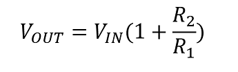

# Op-amp Non-inverting PGA Mindi simulation for PIC16F17146 product family

**Note : Currently, this repository contains Mindi model of PIC18-Q41 family's OPAMP module. Mindi model of PIC16F17146 family's OPAMP module will be available soon.**

This guide will get you up and running with simulating the analog OPAMP module in PIC16F17146 family devices using the Mindi simulation tool. For more information about getting started with and using the MPLAB Mindi Analog Simulator please refer to the following resources:

- [Using the MPLAB Mindi Analog Simulator with the 8-Bit Operational Amplifier Module Technical Brief](https://www.microchip.com/DS90003293)
- [Microchip Developer - Introduction to MPLAB Mindi Analog Simulator](https://www.microchipdeveloper.com/mindi:mindi-analog-simulator-introduction)
- [Getting Started with the MPLAB Mindi Analog Simulator Document](https://www.microchip.com/DS50002564)

## Configuration: Non-Inverting Programmable Gain Amplifier (PGA)
The Non-Inverting Programmable Gain Amplifier is a configuration with run-time selectable positive gain.

### Mindi Simulation

Download and open the follower **Mindi schematic [here](https://github.com/microchip-pic-avr-examples/pic16f17146-opamp-mindi-non-inverting-pga/releases/latest)**. Press the _play_ button to simulate with an example stimulus source.

### Adjustment Options
The amplification of the Non-Inverting Programmable Gain Amplifier can be adjusted using any of 8 internal resistor ladder ratio levels by changing the GSEL value in the appropriate OPAxCON register. The table below shows the different gain settings in this mode of operation, and the corresponding GSEL values. This information can also be found in the device datasheet.

|GSEL[2:0]  | R1   | R2   | Non-Inverting (1 + R2/R1)|
|-----------|:----:|:----:|:------------------------:|
|111        | 1R   | 15R  |  16                      |
|110        | 2R   | 14R  |  8                       |
|101        | 4R   | 12R  |  4                       |
|100    	  | 6R   | 10R  |  8/3                     |
|011     	  | 8R   | 8R   |  1                       |
|010        | 12R  | 4R   |  4/3                     |
|001        | 14R  | 2R   |  8/7                     |
|000        | 15R  | 1R   |  16/15                   |

### Updating composer fields
Once the desired result has been verified with Mindi simulation, the corrected values should be moved back into MCC by copying resistor values across to the composer of your preference.

### Don't have Mindi?
You can download and install [Mindi simulation tool](https://www.microchip.com/mplab/mplab-mindi), or use another SPICE simulator of your own preference. For use with different simulators, a plain spice model can be found in "Opamp_PIC18_Q41.txt" to replace the mindi-optimized "Opamp_PIC18_Q41.lb"
